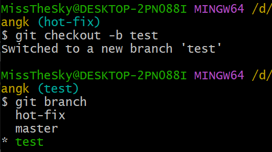
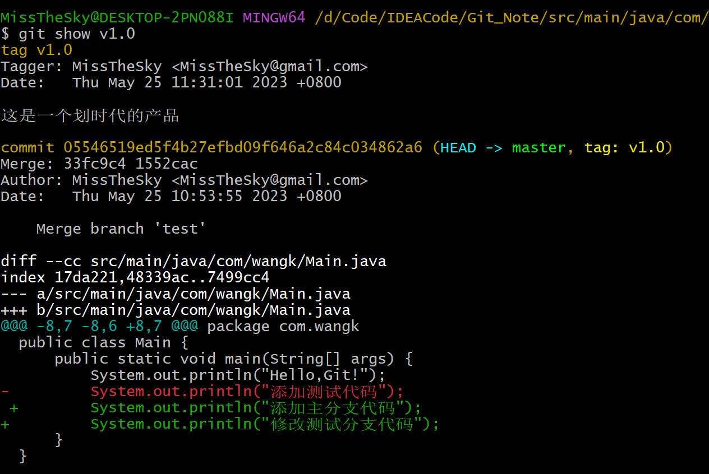
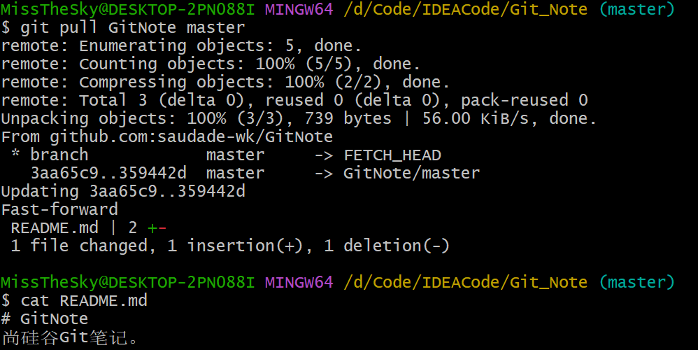
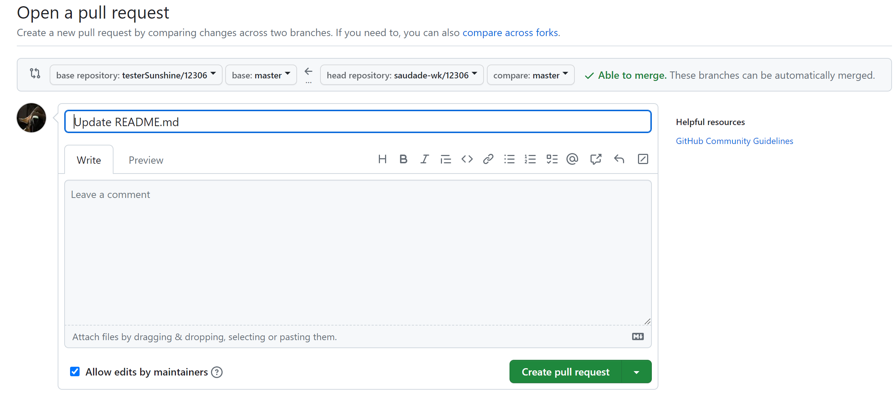
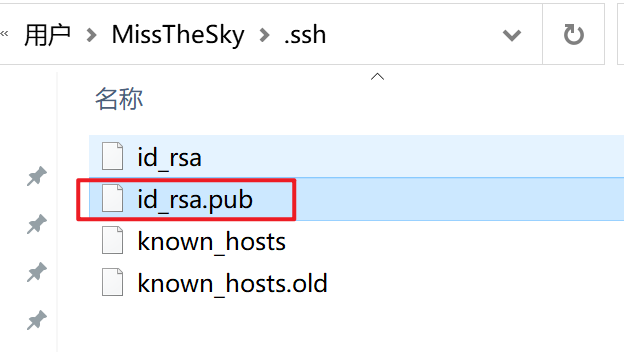

# Git

## 1.版本管理工具介绍

### 1.1 SVN(SubVersion)

工作流程

```
SVN是集中式版本控制系统，版本库是集中放在中央服务器的.
工作流程如下:
	1.从中央服务器远程仓库下载代码
	2.修改后将代码提交到中央服务器远程仓库
```

优缺点:

```
 优点: 简单,易操作
 缺点:所有代码必须放在中央服务器  
  	   1.服务器一旦宕机无法提交代码,即容错性较差
       2.离线无法提交代码,无法及时记录我们的提交行为
```

svn流程图


### 1.2 Git

工作流程

```
Git是分布式版本控制系统（Distributed Version Control System，简称 DVCS），分为两种类型的仓库：
本地仓库和远程仓库
工作流程如下
    1．从远程仓库中克隆或拉取代码到本地仓库(clone/pull)
    2．从本地进行代码修改
    3．在提交前先将代码提交到暂存区
    4．提交到本地仓库。本地仓库中保存修改的各个历史版本
    5．修改完成后，需要和团队成员共享代码时，将代码push到远程仓库
```


总结:git和svn的区别

```
1. svn 是集中式版本控制工具,git 是分布式版本控制工具
2. svn 不支持离线提交,git 支持离线提交代码
```

## 2.git 流程

### 2.1 Git 工作流程

1. 从远程仓库中克隆资源到本地作为本地仓库。
2. 从本地仓库中 checkout 资源到工作区然后进行修改。
3. 在工作区添加、修改资源。
4. 将需要进行版本管理的资源放入暂存。
5. 提交修改，将暂存区的资源提交到本地仓库，本地仓库保存修改的各个历史版本
6. 修改完成后，需要和团队成员共享资源时，可以将资源 push 到远程仓库。

### 2.2 流程图


### 2.3 概念即详解

```
本地仓库：是在开发人员自己电脑上的Git仓库,存放我们的代码(.git 隐藏文件夹就是我们的本地仓库)。本地仓库保存了被提交过的各个版本，比起工作区和暂存区的内容，它更旧一些。需要通过 git commit 同步暂存区的目录树到本地仓库，然后通过 git push 同步本地仓库到远程仓库。

远程仓库：是在远程服务器上的Git仓库,存放代码(可以是github.com或者gitee.com 上的仓库,或者自己该公司的服务器),比起本地仓库，远程仓库通常旧一些，因此本地仓库修改完后要同步到远程仓库。

工作区: 我们自己写代码(文档)的地方

暂存区: 在本地仓库中的一个特殊的文件(index) 叫做暂存区,临时存储我们即将要提交的文件
------------
Clone：克隆，就是将远程仓库复制到本地仓库
Push：推送，就是将本地仓库代码上传到远程仓库
Pull：拉取，就是将远程仓库代码下载到本地仓库,并将代码 克隆到本地工作区
```


- 图中左侧为工作区，右侧为版本库。在版本库中标记为 "index" 的区域是暂存区（stage/index），标记为 "master" 的是 master 分支所代表的目录树。
- 图中我们可以看出此时 "HEAD" 实际是指向 master 分支的一个"游标"。所以图示的命令中出现 HEAD 的地方可以用 master 来替换。
- 图中的 objects 标识的区域为 Git 的对象库，实际位于 ".git/objects" 目录下，里面包含了创建的各种对象及内容。
- 当对工作区修改（或新增）的文件执行`git add`命令时，暂存区的目录树被更新，同时工作区修改（或新增）的文件内容被写入到对象库中的一个新的对象中，而该对象的ID被记录在暂存区的文件索引中。
- 当执行提交操作（git commit）时，暂存区的目录树写到版本库（对象库）中，master 分支会做相应的更新。即 master 指向的目录树就是提交时暂存区的目录树。
- 当执行git reset HEAD`命令时，暂存区的目录树会被重写，被 master 分支指向的目录树所替换，但是工作区不受影响。
- 当执行`git rm --cached <file>`命令时，会直接从暂存区删除文件，工作区则不做出改变。
- 当执行`git checkout .`或者`git checkout -- <file>`命令时，会用暂存区全部或指定的文件替换工作区的文件。这个操作很危险，会清除工作区中未添加到暂存区中的改动。
- 当执行`git checkout HEAD .`或者`git checkout HEAD <file>`命令时，会用 HEAD 指向的 master 分支中的全部或者部分文件替换暂存区和以及工作区中的文件。这个命令也是极具危险性的，因为不但会清除工作区中未提交的改动，也会清除暂存区中未提交的改动。

## 3.Git常用命令

| 命令名称                             | 作用                             |
| :----------------------------------- | :------------------------------- |
| git config --global user.name 用户名 | 设置用户签名                     |
| git config --global user.email 邮箱  | 设置用户邮箱                     |
| ==git init==                         | ==初始化本地库==                 |
| ==git status==                       | ==查看本地库状态==               |
| ==git add 文件名...==                | ==添加一个或多个文件到暂存区==   |
| ==git commit 文件名 -m "日志文件"==  | ==将暂存区内容添加到本地仓库中== |
| ==git reflog、git log==              | ==查看历史版本==                 |
| ==git reset --hard 版本号==          | ==版本穿梭==                     |

### 3.1 设置用户签名信息


说明：

​	签名的作用是区分不同操作者身份。用户的签名信息在每一个版本的提交信息中能够看到，以此确认本次提交是谁做的。Git 首次安装必须设置一下用户签名，否则无法提交代码。 

==※注意：==这里设置用户签名和将来登录 GitHub（或其他代码托管中心）的账号没有任何关系。

### 3.2 初始化本地库

使用当前目录作为 Git 仓库:


初始化后，在当前文件夹下生成一个 .git 文件。

使用我们指定目录作为Git仓库:


初始化后，会在 newrepo 目录下会出现一个名为 .git 的目录，所有 Git 需要的数据和资源都存放在这个目录中。

### 3.3 查看本地库状态

首次查看（工作区没有任何文件）


新增文件（hello.txt）


再次查看（检测到有未被追踪到的文件）


查看状态 使输出信息更加简洁


### 3.4 添加到暂存区

将工作区的文件添加到暂存区


查看状态（检测到暂存区有新文件）


将当前工作目录下的所有修改（包括新文件、修改的文件和删除的文件）添加到Git的暂存区


可以通过`git rm --cached 文件名`删除暂存区的文件，但是工作区的 hello.txt 文件还在。通过查看状态，hello.txt又回到了未被追踪的状态。


`git reset  <文件名>`：将暂存区的文件取消暂存 (取消 add )


### 3.5 提交本地库

`git commit [file1] [file2] ... -m [message]`：提交暂存区的指定文件到仓库区


`git commit -m [message]`：提交暂存区所有文件到本地仓库中


**-a** 参数设置修改文件后不需要执行 git add 命令，直接来提交


查看状态（没有文件需要提交）


### 3.6 修改文件


查看状态（检测到工作区有文件被修改）


将修改的文件再次添加暂存区


查看状态（工作区的修改添加到了暂存区）


提交本地库


查看状态（暂存区没有需要追踪的文件）


### 3.7 删除文件

https://www.jianshu.com/p/c3ff8f0da85e

### 3.8 查看历史版本


### 3.9 版本穿梭

通过 `git reset --hard 版本号`将版本穿梭到最初版，工作区的 hello.txt 文件也变成了最初版。


Git 切换版本，底层其实是移动的 HEAD 指针。master 指向的就是当前的版本号。


## 4.git 分支

在版本控制过程中，同时推进多个任务，为每个任务，我们就可以创建每个任务的单独分支。使用分支意味着程序员可以把自己的工作从开发主线上分离开来，开发自己分支的时候，不会影响主线分支的运行。对于初学者而言，分支可以简单理解为副本，一个分支就是一个单独的副本。（分支底层其实也是指针的引用）


### 4.1 操作分支常用命令

| 命令名称             | 作用                         |
| -------------------- | ---------------------------- |
| git branch 分支名    | 创建分支                     |
| git branch -v        | 查看分支                     |
| git checkout 分支名  | 切换分支                     |
| git branch -d 分支名 | 删除分支                     |
| git merge 分支名     | 把指定的分支合并到当前分支上 |

### 4.2 创建分支


### 4.3 切换、查看分支


也可以使用 `git checkout -b (branchname)` 命令来创建新分支并立即切换到该分支下，从而在该分支中操作。



### 4.4 删除分支


### 4.5 合并分支

#### 4.5.1 正常合并

修改 test 分支内容,然后将修改内容添加暂存区，提交本地库。


在 master 分支上合并 test 分支。


#### 4.5.2 冲突合并

master 分支添加一行代码：


test 分支修改一行代码：


在 master 分支上合并 test 分支


冲突产生的表现：后面状态为 MERGING


冲突产生的原因： 合并分支时，两个分支在同一个文件的同一个位置有两套完全不同的修改。Git 无法替我们决定使用哪一个。必须人为决定新代码内容。

查看状态（检测到有文件有两处修改）


#### 4.5.3 解决冲突

编辑有冲突的文件，删除特殊符号，决定要使用的内容


用 git add添加到暂存区，要告诉 Git 文件冲突已经解决


执行提交（注意：此时使用 git commit 命令时==不能带文件名==，否则报错："cannot do a partial commit during a merge."），合并分支是修改的 master 分支的内容，test 分支的内容不会改变。


## 5. tag 标签

```
如果你的项目达到一个重要的阶段，并希望永远记住那个特别的提交快照，你可以给它打上标签(tag)
比如说，我们想为我们的项目发布一个"1.0"版本。 我们可以用 git tag -a v1.0 命令给最新一次提交打上（HEAD）"v1.0"的标签。
-a 选项意为"创建一个带注解的标签"。 不用 -a 选项也可以执行的，但它不会记录这标签是啥时候打的，谁打的，也不会让你添加个标签的注解。 
```

### 5.1 添加标签


不用 -a 选项也可以执行的，但它不会记录这标签是啥时候打的，谁打的，也不会让你添加个标签的注解。 

当你执行 git tag -a 命令时，Git 会打开你的编辑器，让你写一句标签注解，就像你给提交写注解一样。


当我们执行 git log --decorate 时，我们可以看到我们的标签了：


如果我们忘了给某个提交打标签，又将它发布了，我们可以给它追加标签。


### 5.2 查看已有标签


### 5.2 删除标签


### 5.3 查看此版本所修改的内容



## 6.Git 团队协作机制

### 6.1 团队内协作


### 6.2 跨团队协作


## 7. 远程仓库

### 7.1 远程仓库操作

| 命令名称                               | 作用                                                         |
| -------------------------------------- | ------------------------------------------------------------ |
| git remote -v                          | 显示当前仓库配置的远程仓库的详细信息                         |
| git remote add 别名 远程地址           | 添加远程库                                                   |
| ==git push 别名 分支==                 | ==推送本地分支上的内容到远程仓库==                           |
| ==git clone 远程仓库==                 | ==将远程仓库的内容克隆到本地==                               |
| ==git pull 远程库地址别名 远程分支名== | ==将远程仓库对于分支最新内容拉下来后与当前本地分支直接合并== |

### 7.2 添加、移除远程库


`git remote rm <shortname>`：移除远程仓库和本地仓库的关系(只是从本地移除远程仓库的关联关系，并不会真正影响到远程仓库)


### 7.3 推送本地分支到远程库

`git push [alias] [branch]`：将你的 [branch] 分支推送成为 [alias] 远程仓库上的 [branch] 分支，实例如下。


### 7.4 提取远程仓库

在 GitHub 上添加一个 ReadMe.md


#### 方式一：fetch、merge

使用`git fetch`从远程仓库下载新分支与数据，该命令执行完后需要执行 git merge 远程分支到你所在的分支。


以上信息"90451e4..3aa65c9 master -> GitNote/master" 说明 master 分支已被更新，我们可以使用以下命令将更新同步到本地：

使用`git merge`将从远端仓库提取的数据尝试合并到当前分支。


假设你配置好了一个远程仓库，并且你想要提取更新的数据，你可以首先执行 **git fetch [alias]** 告诉 Git 去获取它有你没有的数据，然后你可以执行 **git merge [alias]/[branch]** 以将服务器上的任何更新（假设有人这时候推送到服务器了）合并到你的当前分支。

#### 方式二：pull

`git pull 远程库地址别名 远程分支名`：将远程仓库对于分支最新内容拉下来后与当前本地分支直接合并



#### 两者区别


**git fetch**:

- `git fetch` 命令将从远程仓库下载最新的提交历史和分支信息，但并不会自动将这些更新应用到本地分支。
- 它会将远程分支的更新保存在本地的 "origin" 分支中（例如，`origin/master`），你可以查看这些更新，并且可以使用其他 Git 命令进行分析和操作。
- `git fetch` 不会修改你当前的工作目录或本地分支，因此它是一种安全的操作，不会引起冲突或覆盖你的本地修改。
- 在完成 `git fetch` 后，你可以使用其他 Git 命令（如 `git merge` 或 `git rebase`）将远程分支的更新合并到你的本地分支。

**git pull**:

- `git pull` 命令是 `git fetch` 和合并操作（`git merge`）的组合，它会从远程仓库获取最新的代码更新，并自动将这些更新应用到当前分支。
- 它会自动将远程分支的更新合并到当前分支，并修改你的本地工作目录和分支状态。
- 如果有冲突产生，`git pull` 会尝试自动合并，但如果自动合并失败，你需要手动解决冲突。
- `git pull` 的使用要谨慎，因为它会直接修改你的本地分支，可能会覆盖你的本地修改。

总结：

- 如果你只是想获取远程仓库的最新代码更新，而不想立即将其合并到本地分支，可以使用 `git fetch`。
- 如果你希望获取远程仓库的最新代码更新，并自动将其合并到当前分支，可以使用 `git pull`。
- 如果你在执行 `git pull` 之前对本地分支进行了修改，可能会导致冲突，因此在使用 `git pull` 之前应该确保本地分支没有未提交的修改或先提交修改。
- 使用 `git fetch` 可以查看远程分支的更新情况，并在合适的时候使用其他 Git 命令将其合并到本地分支。这样可以更加灵活地控制合并的时机和解决冲突。

### 7.5 克隆远程仓库到本地


这个地址为远程仓库地址，克隆结果：初始化本地仓库


小结：clone 会做如下操作。1、拉取代码。2、初始化本地仓库。3、创建别名

### 7.6 跨团队协作

如果看到别人的项目不错，可以 Fork 到自己仓库。


Fork 之后，就会出现在自己的仓库中，我们可以修改使用这个项目，也可以将修改的部分推送给原作者。


点击上方的 Pull Requests


然后添加描述，点击创建，对方就能收到了。



### 7.7 SSH免密登录

1. 进入当前用户的家目录

   

2. 删除.ssh 目录，第一次没有就不管

3. 在这个目录下运行 `ssh-keygen -t rsa -C atguiguyueyue@aliyun.com`，邮箱是GitHub的邮箱。

   

4. 复制 id_rsa.pub 文件内容

   

5. 登录 GitHub，点击用户头像→Settings→SSH and GPG keys

   

6. 接下来再往远程仓库 push 东西的时候使用 SSH 连接就不需要登录了。

## 8. IDEA集成Git

### 8.1 配置Git忽略文件

1）创建忽略规则文件 xxxx.ignore（前缀名随便起，建议是 git.ignore） 

这个文件的存放位置原则上在哪里都可以，为了便于让~/.gitconfig 文件引用，建议也放在用户家目录下 。

git.ignore 文件模版内容如下：

```xml
# Compiled class file
*.class

# Log file
*.log

# BlueJ files
*.ctxt

# Mobile Tools for Java (J2ME)
.mtj.tmp/

# Package Files #
*.jar
*.war
*.nar
*.ear
*.zip
*.tar.gz
*.rar

# virtual machine crash logs, see http://www.java.com/en/download/help/error_hotspot.xml
hs_err_pid*

.classpath
.project
.settings
target
.idea
*.iml
```

2）在.gitconfig 文件中引用忽略配置文件（此文件在 Windows 的家目录中）

```
[user]
	name = MissTheSky
	email = MissTheSky@gmail.com
[core]
	excludesfile = C:/Users/MissTheSky/git.ignore
```

**为什么要忽略他们？** 

答：与项目的实际功能无关，不参与服务器上部署运行。把它们忽略掉能够屏蔽 IDE 工具之间的差异。

### 8.2 配置Git


### 8.3 初始化本地库


### 8.4 添加到暂存区 

右键点击项目选择 Git -> Add 将项目添加到暂存区


###  8.5 提交到本地库


### 8.6 切换版本 


### 8.7 创建、切换分支

方式一：


方式二（创建与切换分支）：


### 8.8 合并分支

#### 正常合并


#### 冲突合并


## 9. IDEA 集成 GitHub

### 9.1 添加账号


然后去 GitHub 账户上设置 token。


### 9.2 分享工程到GitHub


### 9.3 推送本地库到远程库


push 是将本地库代码推送到远程库，如果本地库代码跟远程库代码版本不一致， push 的操作是会被拒绝的。也就是说，要想 push 成功，一定要保证本地库的版本要比远程库的版本高！==因此一个成熟的程序员在动手改本地代码之前，一定会先检查下远程库跟本地代码的区别！如果本地的代码版本已经落后，切记要先 pull 拉取一下远程库的代码，将本地代码更新到最新以后，然后再修改，提交，推送！==

### 9.4 拉取代码

pull 是拉取远端仓库代码到本地，如果远程库代码和本地库代码不一致，会自动合并，如果自动合并失败，还会涉及到手动解决冲突的问题。


### 9.5 克隆代码到本地


## 10. 命令行-- git基本操作

### 10.1 环境配置

当安装Git后首先要做的事情是设置用户名称和email地址。这是非常重要的，因为每次Git提交都会使用该用户信息

```shell
#设置用户信息 
   git config --global user.name “itcast”
   git config --global user.email “itcast@itcast.cn”
#查看配置信息
   git config --list
   git config user.name
#通过上面的命令设置的信息会保存在~/.gitconfig文件中
```

### 10.2  初始化本地仓库 init

```shell
# 初始化仓库带工作区
git init
# 初始化仓库不带工作区
git init --bare  
```

### 10.3 克隆 clone

```shell
# 从远程仓库克隆
git clone 远程Git仓库地址 
例如: git clone https://gitee.com/itcast/gittest.git
```

### 10.4 查看状态 status

```shell
# 查看状态
git status 
#查看状态 使输出信息更加简洁
git status –s 
```

### 10.5 add 

```shell
# 将未跟踪的文件加入暂存区
git add  <文件名>  
# 将暂存区的文件取消暂存 (取消 add )
git reset  <文件名>  
```

### 10.6 commit

```shell
# git commit 将暂存区的文件修改提交到本地仓库
git commit -m "日志信息"  <文件名>  
```

### 10.7 删除 rm

```shell
# 从本地工作区 删除文件
git rm <文件名>  
# 如果本工作区库误删, 想要回退
git checkout head <文件名>  
```

## 11. 命令行-- git 远程仓库操作

### 11.1 查看远程 

```shell
# 查看远程  列出指定的每一个远程服务器的简写
git remote 
# 查看远程 , 列出 简称和地址
git remote  -v  
# 查看远程仓库详细地址
git remote show  <仓库简称>
```

### 11.2 添加/移除远测仓库

```shell
# 添加远程仓库
git remote add <shortname> <url>
# 移除远程仓库和本地仓库的关系(只是从本地移除远程仓库的关联关系，并不会真正影响到远程仓库)
git remote rm <shortname> 
```

### 11.3 从远程仓库获取代码

```shell
# 从远程仓库克隆
git clone <url> 
# 从远程仓库拉取 (拉取到.git 目录,不会合并到工作区,工作区发生变化)
git fetch  <shortname>  <分支名称>
# 手动合并  把某个版本的某个分支合并到当前工作区
git merge <shortname>/<分支名称>
# 从远程仓库拉取 (拉取到.git 目录,合并到工作区,工作区不发生变化) = fetch+merge
git pull  <shortname>  <分支名称>
git pull  <shortname>  <分支名称>  --allow-unrelated-histories  #  强制拉取合并
```

注意：如果当前本地仓库不是从远程仓库克隆，而是本地创建的仓库，并且仓库中存在文件，此时再从远程仓库拉取文件的时候会报错（fatal: refusing to merge unrelated histories ），解决此问题可以在git pull命令后加入参数--allow-unrelated-histories (如上 命令)

```shell
# 将本地仓库推送至远程仓库的某个分支
git push [remote-name] [branch-name]
```

## 12. 命令行-- 分支

```shell
# 默认 分支名称为 master
# 列出所有本地分支
git branch
# 列出所有远程分支
git branch -r
# 列出所有本地分支和远程分支
git branch -a
# 创建分支
git branch <分支名>
# 切换分支 
git checkout <分支名>
# 删除分支(如果分支已经修改过,则不允许删除)
git branch -d  <分支名>
# 强制删除分支
git branch -D  <分支名>
```

```shell
# 提交分支至远程仓库
git push <仓库简称> <分支名称>	
# 合并分支 将其他分支合并至当前工作区
git merge <分支名称>
# 删除远程仓库分支
git push origin –d branchName
```

## 13. 命令行-- tag

```shell
# 列出所有tag
git tag
# 查看tag详细信息 
git show [tagName]
# 新建一个tag
git tag [tagName]
# 提交指定tag
$ git push [仓库简称] [tagName]
# 新建一个分支，指向某个tag
$ git checkout -b [branch] [tag]
# 删除本地tag
$ git tag -d [tag]
# 删除远程tag (注意 空格)
$ git push origin :refs/tags/[tag]
```

# 
